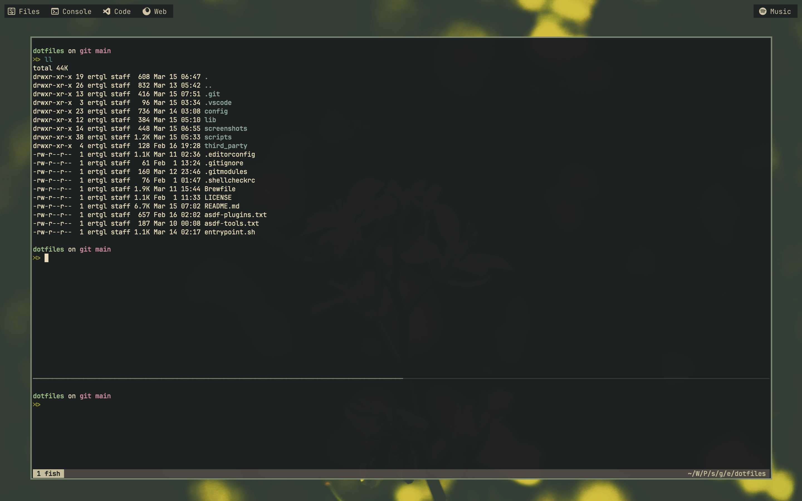

# dotfiles

This repository contains my personal configurations for various tools and
applications.

___



<div align="center">
  <b>
    <small>
      Rocks, soils, leaves, flowers, and the sky.
    </small>
  </b>
</div>

___

## Overview

- **Single command setup**: Works on fresh installs and subsequent updates.
- **[Bash-powered](https://www.gnu.org/software/bash/) automation**: No
  dependencies needed, even on the first run.
- **[Idempotent](https://en.wikipedia.org/wiki/Idempotence) execution**: The
  only side effect is installing new updates.
- **Centralized configuration**:
  Creates [symbolic links](https://en.wikipedia.org/wiki/Symbolic_link)
  targeting the repository.
- **Automatic cleanup**: Removes broken symlinks and orphaned directories.
- **Manual intervention**: Ephemeral or sensitive files are not touched.
- **[XDG](https://specifications.freedesktop.org/basedir-spec/latest/)
  compliant**: Organized and predictable file locations, where possible.
- **GOPATH**: [Go convention](https://go.dev/wiki/GOPATH) for all the projects.
  Improves discoverability.
- **[Homebrew Bundle](https://github.com/Homebrew/homebrew-bundle)**:
  System-wide package management.
- **[asdf](https://asdf-vm.com/)**: Multiple tool and runtime version
  management.
- **[fish](https://fishshell.com/)**: The default shell used for everyday
  tasks, outside the setup process.
- **[Starship](https://starship.rs/)**: Informative shell prompt. No icons for
  better readability.
- **[tmux](https://github.com/tmux/tmux/wiki)**: Terminal multiplexing, beyond
  the tabs and panes.
- **[Alacritty](https://alacritty.org/)**: Lightweight terminal emulator.
- **Natural key bindings in terminal**: Smooth motions, like the native fields.
- **Automatic terminal colors**: Dark or light, follows the system setting.
- **[Neovim](https://neovim.io/)**: Fast and extensible code editor with
  [Tree-sitter](https://tree-sitter.github.io/tree-sitter/) and
  [LSP](https://en.wikipedia.org/wiki/Language_Server_Protocol) support.
- **[Visual Studio Code](https://code.visualstudio.com/)**: General-purpose
  code editor with modern toolchains.
- **[Zen Browser](https://zen-browser.app/)**: Distraction-free web,
  auto-hiding sidebar, vertical tabs.
- **[JetBrains Mono](https://www.jetbrains.com/lp/mono/)**: Font for coding. No
  ligatures for better readability.
- **[Gruvbox](https://github.com/morhetz/gruvbox)-inspired**: The theme for
  welcoming the sunrise with less eye pain.
- **[yabai](https://github.com/koekeishiya/yabai)**: Window management.
  Automatic fullscreening, resizing, and more.
- **[skhd](https://github.com/koekeishiya/skhd)**: Scriptable hotkey
  management.
- **[JankyBorders](https://github.com/FelixKratz/JankyBorders)**: Custom window
  borders. For boosting the botanic feel.
- **[SketchyBar](https://github.com/FelixKratz/SketchyBar)**: Customizable
  status bar. Mostly hidden, bound to a hotkey.
- **[AltTab](https://alt-tab-macos.netlify.app/)**: Application switcher,
  window listing, vertical layout.
- **Background photo from
  [Unsplash](https://unsplash.com/photos/14baodaJBb8?utm_content=creditCopyText&utm_medium=referral&utm_source=unsplash)**:
  Both elegant and wild, nature's own art.

Additional screenshots are in the [`screenshots`](./screenshots) directory.

## Configuration

The configuration files are organized by tool names and are located in the
[`config`](config) directory.

## Scripts

The setup process is automated with the help of Bash scripts. These scripts
are located in the [`scripts`](scripts) directory, and they are organized by
corresponding tools' names.

For reducing the complexity and increasing the maintainability, the scripts
are detected automatically and executed in a structured manner.

The scripts are divided into four categories, each of which is optional, and
must be executed in the respective order:

1. `prepare.sh`: Prepares the environment for the tool.
2. `pre-configure.sh`: Executes preliminary configuration steps.
3. `configure.sh`: Applies the main configurations.
4. `post-configure.sh`: Finalizes the setup.

The automatic detection and execution of the scripts are done with the
following logic:

<ol>
  <li>
    <b>Prioritized Execution</b>:
    <ol>
      <li>
        For each number between 0 and 100, check if a corresponding
        subdirectory exists within each tool's directory.
      </li>
      <li>
        If found, execute the scripts inside that directory.
      </li>
      <li>
        If no matching subdirectory exists, skip to the next tool.
      </li>
    </ol>
  </li>
  <li>
    <b>General Execution</b>:
    <ol>
      <li>
        After the prioritized pass, execute scripts directly present in each
        tool's directory.
      </li>
    </ol>
  </li>
</ol>

## Running the setup

The setup can be run with the following command, from the root directory of the
repository:

```bash
bash entrypoint.sh
```

After setup, a shortcut can be used as well to update tools or apply new
configurations (create symlinks), by running the following
command, from any working directory:

```bash
dotfiles_reload
```

### Partial setup

Running the setup for specific tools is also possible. This can be done by
providing the tool names as arguments to the script:

```bash
bash entrypoint.sh fish tmux
```

Similarly, the shortcut also accepts tool names as arguments:

```bash
dotfiles_reload lsp nvim
```

## Commands

After the setup, several commands are available for the user. Some of the most
relevant ones are:

- `brew_bundle`: Install packages listed in the [`Brewfile`](./Brewfile).
- `brew_update`: Update all installed packages.
- `dotfiles_edit`: Open the dotfiles repository in the code editor.
- `dotfiles_reload`: Reload configurations, update tools, etc.
- `setenv_prefers_color_scheme`: Set terminal color scheme to dark or light.

## Environment variables

After the setup, several environment variables are set for the user. Some of
the most relevant ones are:

- `DOTFILES_DIR`: Path to the dotfiles repository.
- `PREFERS_COLOR_SCHEME`: Preferred color scheme (dark or light).

## Resources

- [Alacritty integration with Tmux](https://arslan.io/2018/02/05/gpu-accelerated-terminal-alacritty)
- [ANSI escape code - Wikipedia](https://en.wikipedia.org/wiki/ANSI_escape_code)
- [Automatic dark mode for terminal applications](https://arslan.io/2021/02/15/automatic-dark-mode-for-terminal-applications)
- [Box-drawing characters - Wikipedia](https://en.wikipedia.org/wiki/Box-drawing_characters)

## License

The files in the [`third_party`](third_party) directory are licensed under
their respective licenses.

The rest of the repository is licensed under the
[MIT License](https://opensource.org/license/mit),
see the [`LICENSE`](./LICENSE) file for more information.
