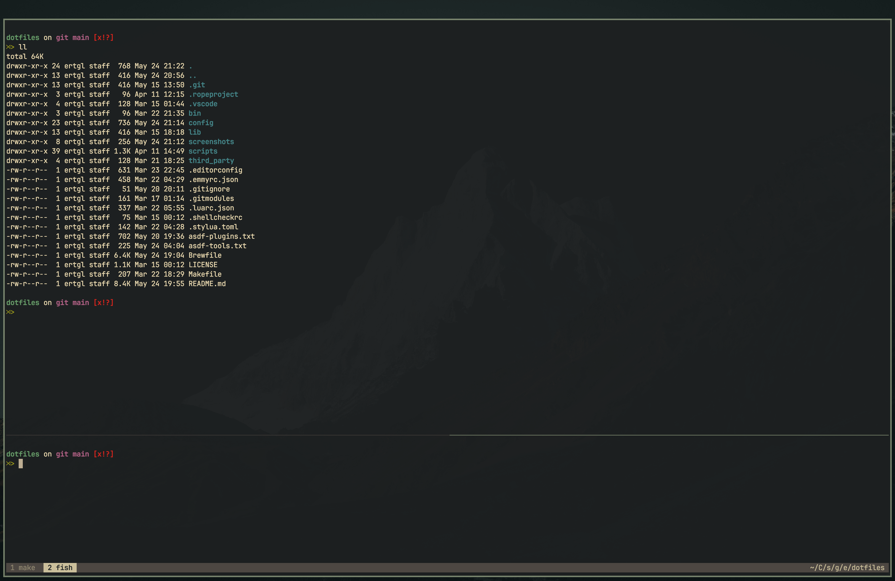

# dotfiles

This repository provides the declarative configuration and automated setup for
my workstation. It transforms a fresh installation into a specialized
environment optimized for focused, low-friction development and code-first
orchestration.

___



<div align="center">
  <b>
    <small>
      Rocks, soils, leaves, flowers, and the sky.
    </small>
  </b>
</div>

___

> [!TIP]
> Additional screenshots are available in the [`screenshots`](./screenshots)
> directory.

___

## Table of Contents

- [Architecture](#architecture)
- [Core Stack](#core-stack)
  - [Applications & Workflows](#applications--workflows)
  - [Aesthetics & Customization](#aesthetics--customization)
- [Repository Structure](#repository-structure)
- [Automation](#automation)
  - [Configuration](#configuration)
  - [Scripts](#scripts)
    - [Priority Resolution](#priority-resolution)
- [Command Interface](#command-interface)
  - [Execution Plan](#execution-plan)
  - [System Reconciliation](#system-reconciliation)
  - [Commands](#commands)
  - [Examples](#examples)
- [Resources](#resources)
- [License](#license)

## Architecture

- **Minimal Dependencies**: Bootstraps natively via
  <a href="https://www.gnu.org/software/bash/" target="_blank">Bash</a>.
- <b><a href="https://en.wikipedia.org/wiki/Idempotence" target="_blank">Idempotent</a></b>:
  Configurations converge to the desired state; safe for repeated execution.
- <b><a href="https://en.wikipedia.org/wiki/Symbolic_link" target="_blank">Symlink</a> Management</b>:
  Centralized configuration projection with automatic cleanup.
- <b><a href="https://specifications.freedesktop.org/basedir/" target="_blank">XDG</a> Compliance</b>:
  Keeps the `$HOME` directory clean.
- <b><a href="https://go.dev/wiki/GOPATH" target="_blank">GOPATH</a> Convention</b>:
  Standardized project paths for improved discoverability.
- **Non-destructive**: Ephemeral and sensitive files are managed manually.

## Core Stack

### Applications & Workflows

<table>
  <thead>
    <tr>
      <th>Category</th>
      <th>Tool</th>
      <th>Description</th>
    </tr>
  </thead>
  <tbody>
    <tr>
      <td>Package manager</td>
      <td><a href="https://docs.brew.sh/Brew-Bundle-and-Brewfile" target="_blank">Homebrew Bundle</a></td>
      <td></td>
    </tr>
    <tr>
      <td>Runtime manager</td>
      <td><a href="https://asdf-vm.com/" target="_blank">asdf</a></td>
      <td></td>
    </tr>
    <tr>
      <td>Window manager</td>
      <td><a href="https://github.com/nikitabobko/AeroSpace" target="_blank">AeroSpace</a></td>
      <td>
        Mostly as an automation for maximizing window sizes without
        full-screening, to maintain zen mode across windows.
      </td>
    </tr>
    <tr>
      <td>App switcher</td>
      <td><a href="https://dockdoor.net/" target="_blank">DockDoor</a></td>
      <td>
        <code>CMD + TAB</code> replacement, for vertical window listing.
      </td>
    </tr>
    <tr>
      <td>Hotkey daemon</td>
      <td><a href="https://github.com/jackielii/skhd.zig" target="_blank">skhd</a></td>
      <td></td>
    </tr>
    <tr>
      <td>Shell</td>
      <td><a href="https://fishshell.com/" target="_blank">fish</a></td>
      <td></td>
    </tr>
    <tr>
      <td>Terminal</td>
      <td><a href="https://sw.kovidgoyal.net/kitty/" target="_blank">kitty</a></td>
      <td></td>
    </tr>
    <tr>
      <td>Terminal multiplexer</td>
      <td><a href="https://github.com/tmux/tmux/wiki" target="_blank">tmux</a></td>
      <td>
        Beyond the tabs and panes. For example; can be integrated with
        process-oriented workflows via
        <a href="https://github.com/DarthSim/overmind" target="_blank" title="Overmind: Process manager for Procfile-based applications.">overmind</a>.
      </td>
    </tr>
    <tr>
      <td>Terminal file manager</td>
      <td><a href="https://github.com/sxyazi/yazi" target="_blank">Yazi</a></td>
      <td></td>
    </tr>
    <tr>
      <td>Editor</td>
      <td><a href="https://neovim.io/" target="_blank">Neovim</a></td>
      <td>
        <p>
          Native
          <a href="https://tree-sitter.github.io/tree-sitter/" target="_blank">Tree-sitter</a>
          and
          <a href="https://en.wikipedia.org/wiki/Language_Server_Protocol" target="_blank">LSP</a>
          support.
        </p>
        <p>
          I like and respect
          <a href="https://www.gnu.org/software/emacs/" target="_blank">Emacs</a>.
        </p>
      </td>
    </tr>
    <tr>
      <td>GUI Editor</td>
      <td><a href="https://code.visualstudio.com/" target="_blank">Visual Studio Code</a></td>
      <td></td>
    </tr>
    <tr>
      <td>Browser</td>
      <td><a href="https://zen-browser.app/" target="_blank">Zen</a></td>
      <td>
        Distraction-free web, auto-hiding sidebar, vertical tabs.
      </td>
    </tr>
  </tbody>
</table>

### Aesthetics & Customization

<table>
  <thead>
    <tr>
      <th>Category</th>
      <th>Tool</th>
      <th>Description</th>
    </tr>
  </thead>
  <tbody>
    <tr>
      <td>Theme</td>
      <td><a href="https://github.com/morhetz/gruvbox" target="_blank">Gruvbox</a>-inspired</td>
      <td>Consistent semantic coloring.</td>
    </tr>
    <tr>
      <td>Window borders</td>
      <td><a href="https://github.com/FelixKratz/JankyBorders" target="_blank">JankyBorders</a></td>
      <td>For boosting the calm botanic feel.</td>
    </tr>
    <tr>
      <td>Command line prompt</td>
      <td><a href="https://starship.rs/" target="_blank">Starship</a></td>
      <td>Without icons, focusing on pure readability.</td>
    </tr>
    <tr>
      <td>Code & terminal typography</td>
      <td><a href="https://www.jetbrains.com/lp/mono/" target="_blank">JetBrains Mono</a></td>
      <td>No ligatures, maximizing clarity.</td>
    </tr>
  </tbody>
</table>

## Repository Structure

```sh
.
├── bin/            # Entrypoint commands.
├── config/         # Symlink targets.
├── lib/            # Shared shell primitives.
├── scripts/        # Staged orchestration logic.
├── third_party/    # External assets.
├── Brewfile
├── asdf-tools.txt
└── asdf-plugins.txt
```

## Automation

### Configuration

The configuration files are organized by tool names and are located in the
[`config`](config/) directory.

### Scripts

The setup process is completely automated using structured Bash scripts inside
the [`scripts`](scripts/) directory. To reduce complexity and ensure
maintainability, scripts are detected automatically and executed in a strict
lifecycle within their resolved priority blocks.

<table>
  <thead>
    <tr>
      <th>Stage</th>
      <th>Script</th>
      <th>Purpose</th>
    </tr>
  </thead>
  <tbody>
    <tr>
      <td>1</td>
      <td><code>setup.sh</code></td>
      <td>Binary/package installation.</td>
    </tr>
    <tr>
      <td>2</td>
      <td><code>prepare.sh</code></td>
      <td>Environment readiness.</td>
    </tr>
    <tr>
      <td>3</td>
      <td><code>configure.sh</code></td>
      <td>Static configuration projection.</td>
    </tr>
    <tr>
      <td>4</td>
      <td><code>sync.sh</code></td>
      <td>Stateful reconciliation.</td>
    </tr>
    <tr>
      <td>5</td>
      <td><code>reload.sh</code></td>
      <td>Configuration hot-reloading.</td>
    </tr>
    <tr>
      <td>6</td>
      <td><code>restart.sh</code></td>
      <td>Service restart.</td>
    </tr>
  </tbody>
</table>

#### Priority Resolution

Step directories encode execution priority:

```text
scripts/<tool>/<step>/<stage_name>.sh
```

Rules:

- Steps are numeric.
- Lower numeric values execute first.
- Scripts without a numeric parent directory are treated as the lowest
  priority.

Example:

<details>
  <summary>
    Toggle output of a sample execution plan
  </summary>

  <ol>
    <li><code>usr-local/0/prepare.sh</code></li>
    <li><code>xcode-select/0/setup.sh</code></li>
    <li><code>xcode-select/0/prepare.sh</code></li>
    <li><code>homebrew/1/setup.sh</code></li>
    <li><code>homebrew/1/prepare.sh</code></li>
    <li><code>homebrew/2/sync.sh</code></li>
    <li><code>dotfiles/3/prepare.sh</code></li>
    <li><code>git/3/configure.sh</code></li>
    <li><code>wxwidgets/3/setup.sh</code></li>
    <li><code>fish/4/prepare.sh</code></li>
    <li><code>fish/4/configure.sh</code></li>
    <li><code>asdf/5/sync.sh</code></li>
    <li><code>shell/5/prepare.sh</code></li>
    <li><code>asdf/6/sync.sh</code></li>
    <li><code>elixir/8/prepare.sh</code></li>
    <li><code>erlang/8/prepare.sh</code></li>
    <li><code>node/8/prepare.sh</code></li>
    <li><code>python/8/prepare.sh</code></li>
    <li><code>ruby/8/prepare.sh</code></li>
    <li><code>rust/8/prepare.sh</code></li>
    <li><code>fc-cache/98/reload.sh</code></li>
    <li><code>tmux/98/setup.sh</code></li>
    <li><code>tmux/98/sync.sh</code></li>
    <li><code>aerospace/configure.sh</code></li>
    <li><code>aerospace/reload.sh</code></li>
    <li><code>borders/configure.sh</code></li>
    <li><code>borders/restart.sh</code></li>
    <li><code>dark-mode-notify/setup.sh</code></li>
    <li><code>dark-mode-notify/configure.sh</code></li>
    <li><code>dark-mode-notify/restart.sh</code></li>
    <li><code>defaults/configure.sh</code></li>
    <li><code>dotfiles/prepare.sh</code></li>
    <li><code>emacs/configure.sh</code></li>
    <li><code>emacs/sync.sh</code></li>
    <li><code>etc-paths/configure.sh</code></li>
    <li><code>ghostty/configure.sh</code></li>
    <li><code>gpg/configure.sh</code></li>
    <li><code>hushlogin/prepare.sh</code></li>
    <li><code>ipython/configure.sh</code></li>
    <li><code>karabiner/configure.sh</code></li>
    <li><code>kitty/configure.sh</code></li>
    <li><code>linearmouse/configure.sh</code></li>
    <li><code>mlx/prepare.sh</code></li>
    <li><code>nvim/configure.sh</code></li>
    <li><code>nvim/sync.sh</code></li>
    <li><code>skhd/setup.sh</code></li>
    <li><code>skhd/configure.sh</code></li>
    <li><code>skhd/restart.sh</code></li>
    <li><code>starship/configure.sh</code></li>
    <li><code>tmux/configure.sh</code></li>
    <li><code>tmux/sync.sh</code></li>
    <li><code>vim/configure.sh</code></li>
    <li><code>vim/sync.sh</code></li>
    <li><code>xcodebuild/setup.sh</code></li>
    <li><code>xcodebuild/prepare.sh</code></li>
    <li><code>yazi/setup.sh</code></li>
    <li><code>yazi/configure.sh</code></li>
  </ol>
</details>

## Command Interface

### Execution Plan

Output the execution plan:

```sh
bash bin/dotfiles_plan.sh
```

### System Reconciliation

Full system reconciliation:

```sh
bash bin/dotfiles_reload.sh
```

Partial system reconciliation:

```sh
bash bin/dotfiles_reload.sh <tool>...
```

### Commands

<table>
  <thead>
    <tr>
      <th>Command</th>
      <th>Purpose</th>
    </tr>
  </thead>
  <tbody>
    <tr>
      <td><code>brew_bundle</code></td>
      <td>Install packages defined in <a href="Brewfile"><code>Brewfile</code></a>.</td>
    </tr>
    <tr>
      <td><code>brew_update</code></td>
      <td>Update installed packages.</td>
    </tr>
    <tr>
      <td><code>dotfiles_edit</code></td>
      <td>Open the dotfiles repository in the editor.</td>
    </tr>
    <tr>
      <td><code>dotfiles_plan</code></td>
      <td>Alias for <code>bin/dotfiles_plan.sh</code> script.</td>
    </tr>
    <tr>
      <td><code>dotfiles_pull</code></td>
      <td>Pull the latest dotfiles changes from the remote repository.</td>
    </tr>
    <tr>
      <td><code>dotfiles_push</code></td>
      <td>Push local dotfiles changes to the remote repository.</td>
    </tr>
    <tr>
      <td><code>dotfiles_reload</code></td>
      <td>Alias for <code>bin/dotfiles_reload.sh</code> script.</td>
    </tr>
    <tr>
      <td><code>dr</code></td>
      <td>Alias for <code>dotfiles_reload</code>.</td>
    </tr>
  </tbody>
</table>

### Examples

Reload Neovim state:

```sh
dr nvim
```

Reload fish and tmux:

```sh
dr fish tmux
```

Perform full setup or update:

```sh
dr
```

## Resources

- <a href="https://en.wikipedia.org/wiki/ANSI_escape_code" target="_blank">ANSI escape code - Wikipedia</a>
- <a href="https://arslan.io/2021/02/15/automatic-dark-mode-for-terminal-applications" target="_blank">Automatic dark mode for terminal applications</a>
- <a href="https://en.wikipedia.org/wiki/Box-drawing_characters" target="_blank">Box-drawing characters - Wikipedia</a>

## License

The files under the [`third_party`](third_party) directory retain their
original licenses.

All other repository content is licensed under the
<a href="https://opensource.org/license/mit" target="_blank">MIT License</a>.

See the [`LICENSE`](./LICENSE) file for the details.
