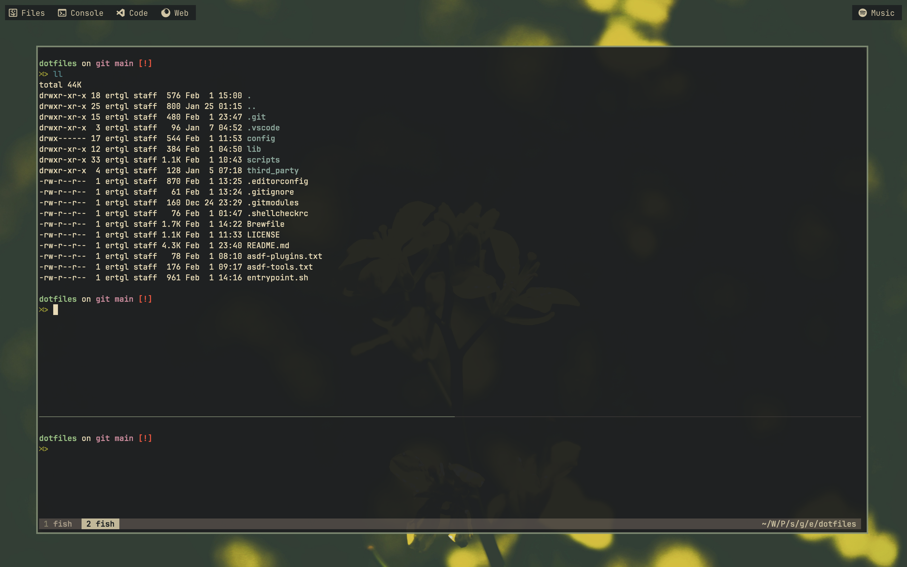

# dotfiles

This repository contains configurations for various tools and applications I
use daily.

___



<div align="center">
  <samp>
    <small>
      Rocks, soils, leaves, flowers, and the sky.
    </small>
  </samp>
</div>

___

## Features

- **Reusable setup**: Fresh installations or subsequent updates.
- **Bash-powered**: Automated using Bash scripts.
- **Idempotence**: Safe to run multiple times.
- **Symbolic links**: Centralized configuration management.
- **Automatic cleanup**: Removes obsolete configurations.
- **Exclusion of sensitive data**: Non-symbolic files remain untouched.
- **XDG Base Directory Specification**: Predictable configuration locations.
- **GOPATH**: Centralized projects directory, even for non-Go projects.
- **Homebrew Bundle**: System-wide package management.
- **asdf**: Multiple tool and runtime version management.
- **fish**: Default shell.
- **Starship**: Plain text shell prompt.
- **tmux**: Terminal multiplexing.
- **Alacritty**: High-performance terminal emulator.
- **Native-input-like terminal key bindings**: Enhanced motion and editing.
- **Automatic dark/light mode**: Adapts to system theme.
- **Neovim**: Lightweight code editor with LSP support.
- **Visual Studio Code**: Occasionally used for some tasks.
- **Zen Browser**: Calmer web experience, and vertical tabs.
- **Jetbrains Mono**: Terminal and development font.
- **Gruvbox-inspired**: The theme for welcoming the sunrise with less eye pain.
- **yabai**: Tiling window manager for macOS.
- **skhd**: Hotkey management for macOS.
- **JankyBorders**: Customizable window borders for macOS.
- **SketchyBar**: Customizable status bar for macOS.
- **AltTab**: Application switcher with vertical layout.
- **Background photo from Unsplash**: Wild but elegant one.

Additional screenshots are in the [`screenshots`](./screenshots) directory.

## Scripts

The [`scripts`](./scripts) directory contains setup scripts, organized by tool.
Execution process:

1. Loop through numbers 0 to 100 for prioritization.
2. Iterate over subdirectories within `scripts`.
3. Execute scripts in order: `prepare.sh`, `pre-configure.sh`, `configure.sh`,
  `post-configure.sh`.

## Running the setup

Install or update tools with:

```bash
bash entrypoint.sh
```

After setup, use the shortcut:

```bash
dotfiles_reload
```

### Partial setup

Run setup for specific tools:

```bash
bash entrypoint.sh fish tmux
```

Or use the shortcut:

```bash
dotfiles_reload fish tmux
```

## Commands

- `brew_bundle`: Install packages from the [`Brewfile`](./Brewfile).
- `brew_update`: Update all installed packages.
- `dotfiles_reload`: Reload configurations.
- `setenv_prefers_color_scheme`: Set terminal color scheme.

## Environment variables

- `DOTFILES`: Path to the dotfiles repository.
- `PREFERS_COLOR_SCHEME`: Preferred color scheme (dark or light).

## Resources

- [Alacritty integration with Tmux](https://arslan.io/2018/02/05/gpu-accelerated-terminal-alacritty)
- [ANSI escape code - Wikipedia](https://en.wikipedia.org/wiki/ANSI_escape_code)
- [Automatic dark mode for terminal applications](https://arslan.io/2021/02/15/automatic-dark-mode-for-terminal-applications)
- [Box-drawing characters](https://en.wikipedia.org/wiki/Box-drawing_characters)
- [Go Wiki: GOPATH - The Go Programming Language](https://go.dev/wiki/GOPATH)
- [Idempotence - Wikipedia](https://en.wikipedia.org/wiki/Idempotence)
- [XDG Base Directory Specification](https://specifications.freedesktop.org/basedir-spec/latest/)
